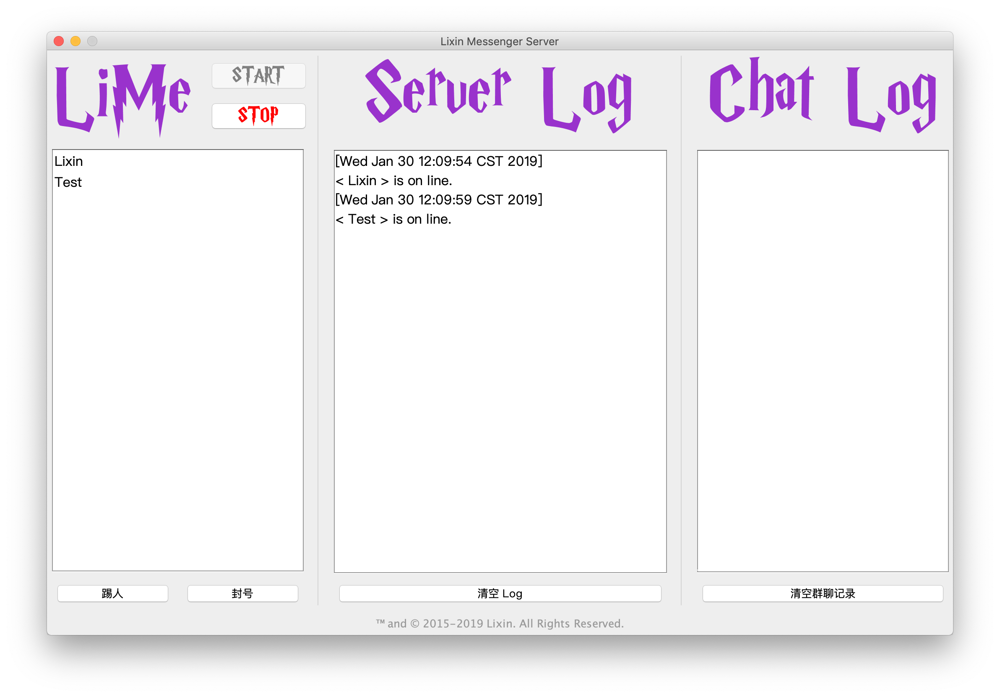
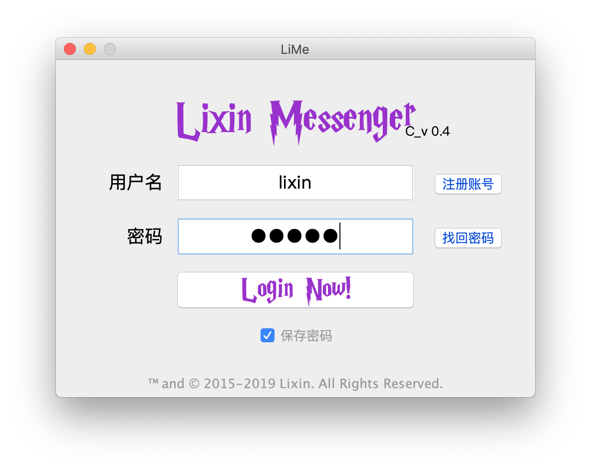
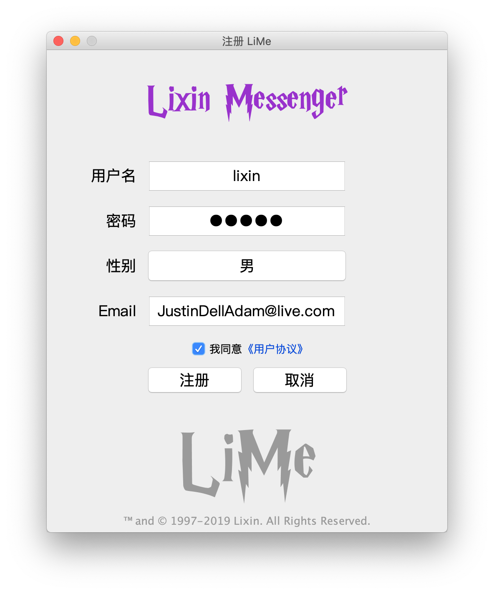
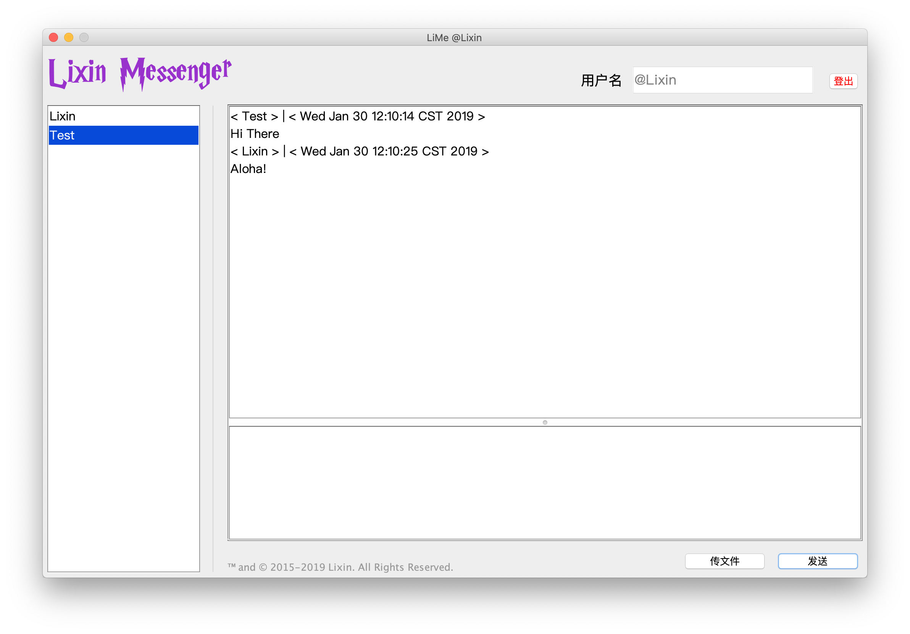
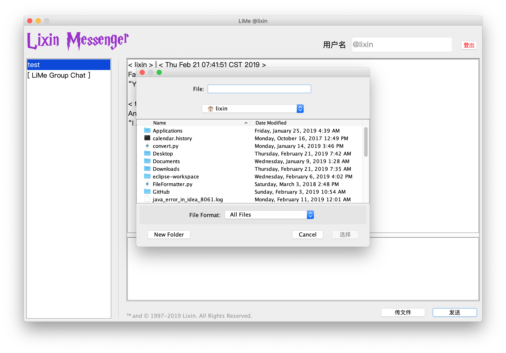

# LiMe
The Li Xin Messenger

## Version
- C_v 0.3
- S_v 0.3

```
 _________________
< Finally, v_0.3! >
 -----------------
        \   ^__^
         \  (oo)\_______
            (__)\ LiMe  )\/\
                ||----w |
                ||     ||
```

## Platform compatibility: 
- macOS
> If you would like to use it with windows, you should clone this repo and rebuild it with windows


## The Server GUI


## Client

The Login GUI, also the welcome page



The Register GUI



The Chat GUI of user @Lixin, the friend list is on the left side of the panel


The Chat GUI of user @Test


## The File Transmission



## Data persistence and user management

MySQL

## TODO
- The process bar for the file transmission
- Anonymous group chat for all users
- A fancy website for LiMe
