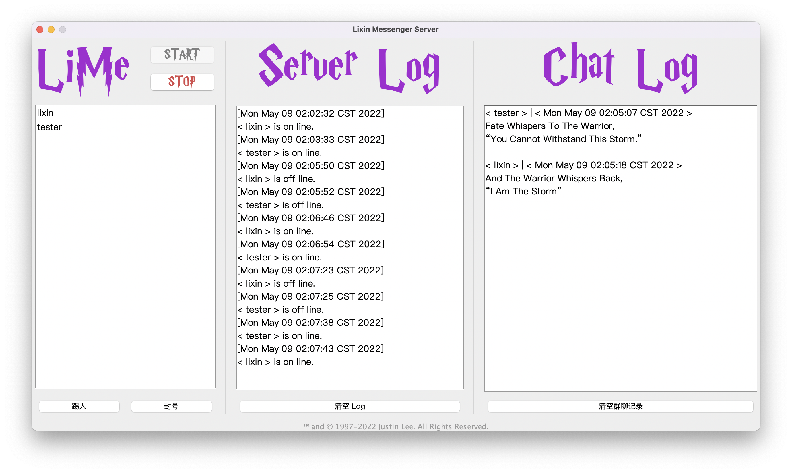

# LiMe

[](https://travis-ci.org/Great-Li-Xin/LiMe)

## The Li Xin Messenger

LiMe is a communication application implemented in Java that allows you to keep in touch and exchange files with friends anytime, anywhere.
You can also quickly deploy a custom LiMe server for private communication.

## Tech Reviews
- LiMe is developed in the MVC design pattern. 
- We use Swing to implement the UI layer. 
- The persistence layer is implemented with JDBC. 
- As for the database, we chose MySQL. 
- The model layer is strictly following JavaBean specification requirements. 
- Fully comply with the code specification in the Alibaba Java Development Manual, 
- Each layer achieves high cohesion and low coupling, which significantly leverages the scalability and the maintainability of this project.

## Requirements
- JRE 12.0.1
  > Sorry. This project is compiled with Oracle JDK.

  ```
  java version "12.0.1" 2019-04-16
  Java(TM) SE Runtime Environment (build 12.0.1+12)
  Java HotSpot(TM) 64-Bit Server VM (build 12.0.1+12, mixed mode, sharing)
  ```
  > If you would like to adapt this project to business use.  
  > Please rebuild this project with Non-Oracle JDK or `OpenJDK`, Thanks.

## Code Guide Lines
This repository follows the guideline of the Alibaba coding guidelines.

For more information, please refer to the *Alibaba Java Coding Guidelines*:
- Chinese Version: *[阿里巴巴Java开发手册](https://github.com/alibaba/p3c/blob/master/%E9%98%BF%E9%87%8C%E5%B7%B4%E5%B7%B4Java%E5%BC%80%E5%8F%91%E6%89%8B%E5%86%8C%EF%BC%88%E8%AF%A6%E5%B0%BD%E7%89%88%EF%BC%89.pdf)*
- English Version: *[Alibaba Java Coding Guidelines](https://alibaba.github.io/Alibaba-Java-Coding-Guidelines)*

## Version
- C_v 0.6.4
- S_v 0.6.4

  ```
   _______________________
  /    Finally, v0.6.4!   \
  |  _     _ __  __       |
  | | |   (_)  \/  | ___  |
  | | |   | | |\/| |/ _ \ |
  | | |___| | |  | |  __/ |
  | |_____|_|_|  |_|\___| |
  \                       /
   -----------------------
          \   ^__^
           \  (oo)\_______
              (__)\ LiMe  )\/\
                  ||----w |
                  ||     ||
  ```

## Platform compatibility: 
- macOS
  > If you would like to use it with windows, you should clone this repo and rebuild it with windows.

## Protocol
To enable a more efficient and secure LiMe, we set up an application layer protocal.  

## The Server GUI


## Client

The Login GUI and the welcome page as well.


The Register GUI


The User Agreement (HTML parsing)


The Chat GUI of user @lixin, the friend list is on the left side of the panel


The Chat GUI of user @test


### The Group Chat


### The File Transmission


## Data persistence

MySQL table structure


## Emails you might get from the server

Registration Confirmation


Banned Notification


Password Reset


## TODO
- [ ] Adapt Travis CI ATS
- [ ] Rebuild The Protocol with Restful API (json)
- [ ] Gradle the project
- [ ] Use HTML to render the email content
- [ ] Use hibernate or Mybatis as a persistence framework
- [ ] The process bar for the file transmission
- [ ] A fancy website for LiMe
- [x] Merge all the services out of ~~P.R.China~~ to provide a global-based service.
- [x] Store the password on the server with MD5
- [x] Local password storage encrypted with AES using a random key, the random key stored with AES digested with MD5
- [x] Transport the message with AES and keys digested with MD5
- [x] Open group chat for all users
- [x] Enable user to reset the password via a server-sent Email
- [x] Redirect LiMe to the new domain name
- [x] Email should be a unique key (LiMeSeedRecoverPassword)
- [x] The file transmission function
- [x] Use the database to validate and manage the user
- [x] Blur Agreement Frame
- [x] HTML parsing and rendering
- [x] Version number increase

## Test Quote
```
Fate Whispers To The Warrior,
“You Cannot Withstand This Storm.”

And The Warrior Whispers Back,
“I Am The Storm”
```

# Made with ❤ by [Li Xin](https://github.com/Great-Li-Xin)!
™ and © 1997-2019 Li Xin. All Rights Reserved. [License Agreement](./LICENSE)
